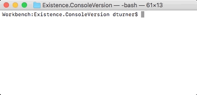
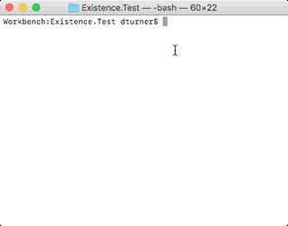

[](https://travis-ci.com/doymturner/GameOfLife)

# Conway's Game of Life

> A TDD Approach

## [Rules](https://github.com/doymturner/GameOfLife.git)

## Setup CSharp Version

Install: [Dot Net Core](https://www.microsoft.com/net/learn/get-started) (Mac, Windows, or Linux)

## Running the thing

1. Clone this repo locally.
2. Navigate Existence.ConsoleVersion from within your command line of choice.
3. Run: dotnet run
4. Watch the application run through iterative generation (one per second) until you provide the kill command within your terminal!



*Alternatively* Run Console Application from with Visual Studio

### Running Tests

0. Have you met the prerequisites?
1. Navigate to the local copy of "Existence.Test" directory in your favorite command line.
2. Run 'test' command

``` shell
    dotnet test
```



*Alternatively* Run test from withing Visual Studio
